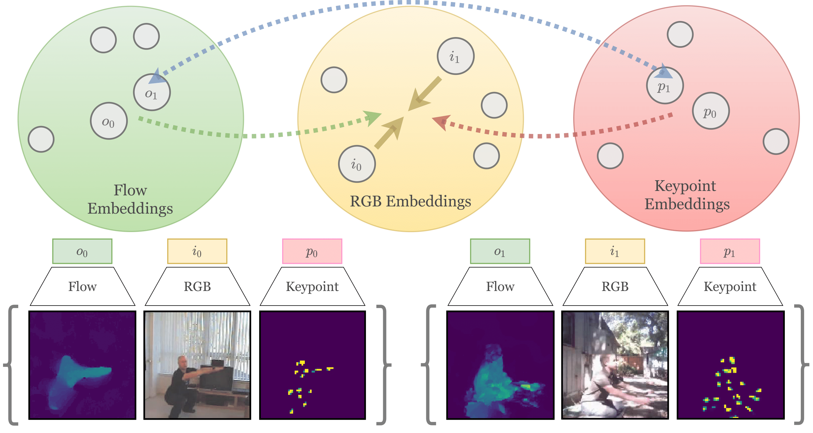
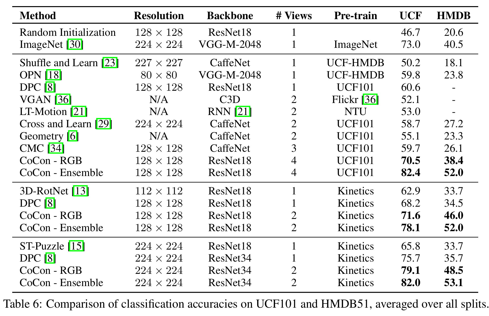

## CoCon: Coooperative Contrastive Learning for Video Representation Learning

This repository contains the implementation of Cooperative Contrastive Learning (CoCon) for video representation
 learning. We utilize multiple views of videos in order to learn better representations capturing semantics suitable
  for tasks related to video understanding.



### Installation

Our implementation should work with python >= 3.6, pytorch >= 0.4, torchvision >= 0.2.2. The repo also requires cv2
 (`conda install -c menpo opencv`), tensorboardX >= 1.7 (`pip install tensorboardX`), tqdm.

A requirements.txt has been provided which can be used to create the exact environment required.
  ```
  pip install -r requirements.txt
  ```

### Prepare data

Follow the instructions [here](process_data/). Instructions to generate multi-view data for custom datasets will be
 added soon.

### Cooperative Contrastive Learning (CoCon)

Training scripts are present in `cd CoCon/train/`

Run `python model_trainer.py --help` to get details about the command lines args. The most useful ones are `--dataset
` and `--modalities`, which are used to change the dataset we're supposed to run our experiments along with the input
 modalities to use. 
 
Our implementation has been tested with RGB, Optical Flow, Segmentation Masks, Human Keypoints
 . However, it is easy to extend it to custom views; look at `dataset_3d.py` for details.

* Single View Training: train CoCon using 2 GPUs, using RGB inputs, with a 3D-ResNet18 backbone, on UCF101 with 224x224
 resolution, for 100 epochs. Batch size is per-gpu.
  ```
  CUDA_VISIBLE_DEVICES="0,1" python model_trainer.py --net resnet18 --dataset ucf101 --modalities imgs 
  --batch_size 16 --img_dim 224 --epochs 100
  ```

* Multi-View Training: train CoCon using 4 GPUs, using RGB, Flow, Pose, Keypoints inputs, with a 3D-ResNet18 backbone
, on HMDB51 with 128x128 resolution, for 100 epochs
  ```
  CUDA_VISIBLE_DEVICES="0,1,2,3" python model_trainer.py --net resnet18 --dataset hmdb 
  --modalities imgs_flow_seg_kphm --batch_size 16 --img_dim 128 --epochs 100
  ```

* Heavy Multi-View Training: train CoCon using 4 GPUs, using RGB, Flow inputs, with 3D-ResNet34 backbone, on Kinetics400
 dataset with 128x128 resolution, for 50 epochs
  ```
  CUDA_VISIBLE_DEVICES="0,1,2,3" python model_trainer.py --net resnet18 --dataset kinetics 
  --modalities imgs_flow --batch_size 8 --img_dim 128 --epochs 50
  ```

### Evaluation: Video Action Recognition

Testing scripts are present in `cd CoCon/test/`

* Evaluate model: Fine-tune pre-trained weights (replace `model_path` with pretrained weights)
  ```
  python test.py --net resnet18 --dataset ucf101 --modality imgs --batch_size 8 --img_dim 128 
  --pretrain {model_path} --epochs 100
  ```

### Results



### Qualitative Evaluation

Scripts for qualitative evaluation will be added here.

### CoCon-pretrained weights

The pre-trained weights will be made available here.

### Acknowledgements

Portions of code have been borrowed from [DPC](https://github.com/TengdaHan/DPC). Feel free to refer to their great
 work as well if you're interested in the field.